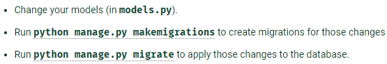

# secure_backend

<h1>Install Dependencies</h1>
Install project dependencies:
<b>$ pip install -r requirements/local.txt</b>

Install postgresql:<b>https://www.postgresql.org/download/</b>

<h1>To Start</h1>
Then simply apply the migrations:
<b>$ python manage.py migrate</b>

You can now run the development server:
<b>$ python manage.py runserver</b>

To change the model schema:

    </img>

# How to run and test for the testing team
